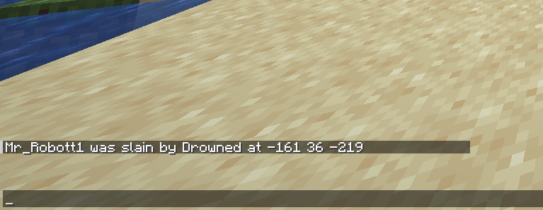

# Death Locator

**Death Locator** is a server side only mod that shows your cordinates at death messages when you die.
 

> Works with vanilla clients.

# Installation

- Go to [Releases](https://github.com/carloshmfs/DeathLocator/releases) and download version and target you need
- Move the `.jar` file in the server `./mods` folder
